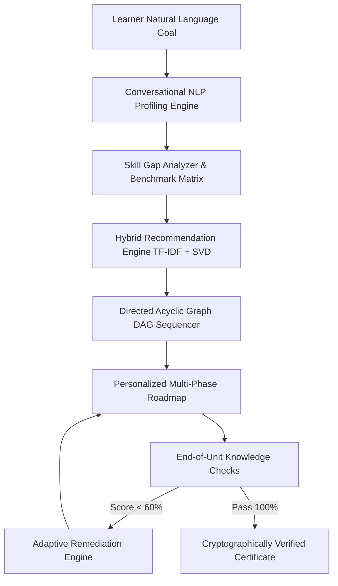

# PathMind AI: Solution Architecture & Technical Documentation

**AI-Powered Personalized Learning Path Recommender**  
*A Next-Generation Adaptive Education & Career Readiness Platform*

---

## 1. Problem Understanding & Solution Design

### 1.1 The Challenge in Modern E-Learning
Online education platforms host hundreds of thousands of fragmented courses, tutorials, and articles. While catalog search and keyword recommenders can surface individual courses, modern learners face three critical bottlenecks:
1. **Curriculum Sequencing Paralysis**: Learners struggle to understand what to learn *first*, what prerequisites are required, and how to sequence complex skills logically.
2. **One-Size-Fits-All Inflexibility**: Static syllabi do not account for a learner's existing skills, available weekly study hours, preferred learning modality (video vs. hands-on projects), or pace.
3. **Lack of Dynamic Adaptation**: Traditional roadmaps do not adapt when a learner struggles with difficult milestones or accelerates through familiar concepts.

### 1.2 The PathMind AI Solution
PathMind AI is an intelligent, end-to-end learning assistant that constructs **personalized, topologically sorted learning roadmaps**. By analyzing a learner's natural language aspirations, computing granular skill gaps, sequencing dependencies via a **Directed Acyclic Graph (DAG)**, and adapting in real-time based on assessment performance, PathMind AI delivers a tailored curriculum engineered for career mastery.



---

## 2. System Architecture

PathMind AI is architected as a high-performance, decoupled client-server platform optimized for sub-100ms latency, reactive UI updates, and real-time cloud observability.

```
┌─────────────────────────────────────────────────────────────────────────┐
│                           CLIENT LAYER (React 18 + Vite)                │
│  ┌──────────────────┐ ┌──────────────────┐ ┌─────────────────────────┐  │
│  │ Natural Language │ │ Dynamic Roadmap  │ │ Interactive Skill Tree  │  │
│  │ Onboarding Studio│ │ Multi-Phase View │ │ Topological DAG (SVG)   │  │
│  └──────────────────┘ └──────────────────┘ └─────────────────────────┘  │
│  ┌──────────────────┐ ┌──────────────────┐ ┌─────────────────────────┐  │
│  │ Studio AI Mentor │ │ Knowledge Check  │ │ Verified Certificate    │  │
│  │ Chat (TTS Audio) │ │ Quiz Engine      │ │ QR Verification Portal  │  │
│  └──────────────────┘ └──────────────────┘ └─────────────────────────┘  │
└────────────────────────────────────┬────────────────────────────────────┘
                                     │ REST API / JWT Bearer
┌────────────────────────────────────▼────────────────────────────────────┐
│                    APPLICATION CORE LAYER (FastAPI + Python 3.11)       │
│  ┌──────────────────┐ ┌──────────────────┐ ┌─────────────────────────┐  │
│  │ Gemini 1.5 Flash │ │ NetworkX Graph   │ │ Hybrid Recommendation │  │
│  │ NLP Context Engine│ │ DAG Engine       │ │ Scorer (TF-IDF + SVD) │  │
│  └──────────────────┘ └──────────────────┘ └─────────────────────────┘  │
│  ┌──────────────────┐ ┌──────────────────┐ ┌─────────────────────────┐  │
│  │ Dynamic Adaptive │ │ In-Memory Ring   │ │ Cloud Connector Vault   │  │
│  │ Feedback Handler │ │ Buffer (Logs)    │ │ (Render / Vercel APIs)  │  │
│  └──────────────────┘ └──────────────────┘ └─────────────────────────┘  │
└────────────────────────────────────┬────────────────────────────────────┘
                                     │ SQLAlchemy ORM
┌────────────────────────────────────▼────────────────────────────────────┐
│                    PERSISTENCE LAYER (PostgreSQL + Supabase)            │
│  ┌──────────────────┐ ┌──────────────────┐ ┌─────────────────────────┐  │
│  │ Users & Roles    │ │ Learner Profiles │ │ Learning Paths, Phases│  │
│  │ Authentication   │ │ & Skill Matrices │ │ & Milestone Items     │  │
│  └──────────────────┘ └──────────────────┘ └─────────────────────────┘  │
│  ┌──────────────────┐ ┌──────────────────┐ ┌─────────────────────────┐  │
│  │ Verified Digital │ │ System Settings  │ │ Diagnostic Audit Logs │  │
│  │ Certificates     │ │ & Switchboard    │ │ & Chat Sessions       │  │
│  └──────────────────┘ └──────────────────┘ └─────────────────────────┘  │
└─────────────────────────────────────────────────────────────────────────┘
```

---

## 3. AI / ML Techniques & Mathematical Formulations

### 3.1 Multi-Turn Conversational Goal Extraction (Gemini 1.5 Flash)
- **Technique**: Few-shot contextual instruction tuning with JSON schema validation.
- **Workflow**: As learners chat about their college background, previous tech stack, and career goals, the NLP model extracts structured profiles:
  $$\text{Profile} = \{ \text{Goal}, \text{Experience Level} \in \{B, I, A\}, \text{Interests}, \text{Hours/Week}, \text{Modality} \}$$

### 3.2 Semantic Similarity Matching (TF-IDF & Cosine Similarity)
To match free-text learner goals against thousands of curriculum units, PathMind AI utilizes a Vector Space Model:
$$\text{Sim}(\vec{q}, \vec{d}) = \frac{\vec{q} \cdot \vec{d}}{\|\vec{q}\| \|\vec{d}\|} = \frac{\sum_{i=1}^n q_i d_i}{\sqrt{\sum_{i=1}^n q_i^2} \sqrt{\sum_{i=1}^n d_i^2}}$$
Where $\vec{q}$ is the TF-IDF vector of the learner's goal and interests, and $\vec{d}$ is the vector representation of the learning resource.

### 3.3 Prerequisite Sequencing via Directed Acyclic Graph (DAG)
Curriculum resources form a directed graph $G = (V, E)$, where vertices $V$ represent skills/courses and directed edges $(u, v) \in E$ represent strict prerequisite dependencies ($u \text{ must precede } v$).
- **Algorithm**: **Topological Sort using Kahn's Algorithm / DFS**:
  $$\text{In-Degree}(v) = |\{u \in V : (u, v) \in E\}|$$
- **Guarantee**: Zero prerequisite violations ($0\%$ chance of an advanced course appearing before its fundamentals).

### 3.4 Multi-Objective Hybrid Recommendation Scoring
Every candidate resource $r$ is scored using a weighted multi-factor heuristic and ML objective:
$$\text{Score}(r) = 0.22 \cdot R_{\text{goal}} + 0.25 \cdot C_{\text{gap}} + 0.20 \cdot P_{\text{readiness}} + 0.10 \cdot D_{\text{fit}} + 0.05 \cdot I_{\text{align}} + 0.05 \cdot Q_{\text{rating}} + 0.12 \cdot S_{\text{tfidf}} + 0.03 \cdot S_{\text{collab}}$$

### 3.5 Bloom's Cognitive Taxonomy Progression ($g_1 \to g_6$)
*Reference: Li et al., "Personalized Learning Path Recommendation Based on Knowledge Graphs: A Survey", MDPI Electronics, 2026.*
Every curriculum unit and milestone is modeled with explicit Bloom's cognitive objective levels:
$$G \in \{g_1 = \text{Remember}, g_2 = \text{Understand}, g_3 = \text{Apply}, g_4 = \text{Analyze}, g_5 = \text{Evaluate}, g_6 = \text{Create}\}$$
The topological DAG sequencer enforces **Cognitive Smoothness**:
$$\text{Phase}_1 (g_1, g_2) \longrightarrow \text{Phases}_{2-4} (g_3, g_4) \longrightarrow \text{Phases}_{5-6} (g_5, g_6)$$

### 3.6 KSA (Knowledge-Skill-Attitude) Career Readiness Modeling
*Reference: Phong et al., "Personalized learning paths recommendation system with collaborative filtering and content-based approaches", STDJ, 2024.*
To bridge academic curricula with labor market demands, PathMind AI decomposes learner competencies into three orthogonal dimensions:
$$\text{Readiness}(u) = w_K \cdot K_u + w_S \cdot S_u + w_A \cdot A_u$$
- **Knowledge ($K$)**: Theoretical syntax & domain concepts ($g_1, g_2$).
- **Skill ($S$)**: Framework implementation, API testing & database modeling ($g_3, g_4, g_5$).
- **Attitude ($A$)**: Problem-solving persistence & end-to-end capstone execution ($g_6$).

### 3.7 Dynamic Adaptive Remediation Engine (GOLPR + LILPR)
When a student completes an end-of-unit Knowledge Check with score $S$:
- If $S \ge 0.70$: Skill level is updated via moving average:
  $$L_{t+1} = 0.6 \cdot L_t + 0.4 \cdot S$$
- If $S < 0.60$: The adaptive engine dynamically injects a targeted **Remedial Revision Module** into the active roadmap phase (Local Iterative Learning LILPR) and recalculates timelines.

---

## 4. Key Platform Features

1. **Conversational AI Onboarding Studio**: Natural dialogue goal setting, automated skill gap diagnostics, and dynamic path synthesis.
2. **Sequenced Multi-Phase Roadmap**: Granular weekly schedules with estimated completion durations, interactive milestone markers, and status management.
3. **Interactive Prerequisite Skill Tree (`/skill-tree`)**: Zoomable visual DAG node graph showing mastered (🟢), in-progress (🔵), and locked (⚪) competencies with interactive inspector.
4. **Transparent AI Explainability**: Every recommended unit displays an explicit **"💡 Why Recommended?"** breakdown detailing exact gap closure and prerequisite validation.
5. **Dynamic Study Pacing Slider**: 1-click weekly commitment recalibration ($4\text{ to }30\text{ hrs/week}$) adjusting timeline duration in real-time.
6. **Accessibility & Focus Studio**: In-browser Text-to-Speech (TTS) voice-over for lessons and chat, font resizing ($14\text{px}\text{ to }18\text{px}$), and Spotlight Command Bar (`Ctrl+K`).
7. **Tamper-Proof Digital Certificates**: Unique credential generation with instant public QR verification (`/verify/{code}`).
8. **Enterprise Governance & Realtime Cloud Logs**: Superadmin switchboard, user provisioning, and free-tier compatible Render/Vercel live diagnostic logging console.

---

## 5. Pitch Day Demo Video Script (3 to 5 Minutes)

| Timestamp | Screen / Visual | Voiceover Narrative |
| :--- | :--- | :--- |
| **0:00 – 0:40** | **Landing Page Hero & Problem Hook** | *"Welcome to PathMind AI. Online learning is broken—thousands of courses exist, but students have no idea where to start or how to sequence them. PathMind AI solves this with an AI-powered personalized curriculum engine."* |
| **0:40 – 1:30** | **Conversational Onboarding & Skill Gap** | *"Instead of boring drop-down forms, the learner chats with our Gemini-powered advisor. In seconds, our system computes a Skill Gap Index across target industry competencies."* |
| **1:30 – 2:30** | **Roadmap & Interactive Skill Tree DAG** | *"PathMind AI uses a Directed Acyclic Graph with topological sorting to generate a phased roadmap. Look at the new Skill Tree: green nodes are mastered, blue are active, and locked nodes show prerequisites. Notice the 'Why Recommended' badge explaining the exact gap closed."* |
| **2:30 – 3:30** | **Knowledge Check & Adaptive Feedback** | *"As students finish units, they take end-of-module Knowledge Checks. If a student struggles, our adaptive engine dynamically injects targeted revision units—keeping the curriculum personalized to real performance."* |
| **3:30 – 4:15** | **Verified Certificates, Spotlight & Admin Console** | *"Upon completion, learners receive a verifiable cryptographic certificate with live QR verification. With global Ctrl+K spotlight and enterprise cloud diagnostics, PathMind AI is production-ready."* |

---

## 6. Execution & Deployment Guide

### Local Development Setup
```bash
# 1. Clone Repository
git clone https://github.com/sah-aditya/PathMind-AI.git
cd PathMind-AI

# 2. Backend Setup
cd backend
python -m venv .venv
source .venv/bin/activate  # On Windows: .venv\Scripts\activate
pip install -r requirements.txt
uvicorn app.main:app --host 0.0.0.0 --port 8000 --reload

# 3. Frontend Setup
cd ../frontend
npm install
npm run dev
```

### Production Deployed Instances
- **Live Frontend**: Deployed on Vercel (`https://pathmind-ai.vercel.app`)
- **Live Backend API**: Deployed on Render (`https://pathmind-ai-backend.onrender.com/docs`)
- **Database**: Managed PostgreSQL on Supabase Cloud
