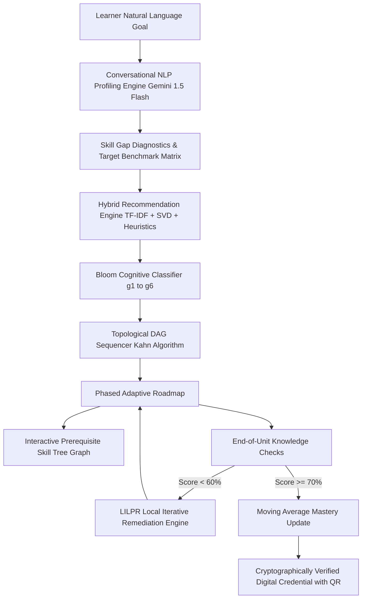

# PathMind AI: Solution Architecture & Technical Documentation

**AI-Powered Personalized Learning Path Recommender**  
*A Next-Generation Adaptive Education & Career Readiness Platform*

---

## 1. Executive Summary & Problem Understanding

### 1.1 The Crisis in Digital Learning
With the rapid growth of online education and Massive Open Online Courses (MOOCs), learners have access to hundreds of thousands of educational resources. However, modern learners frequently experience **cognitive disorientation** and **curriculum sequencing paralysis**:
1. **Lack of Pedagogical Sequencing**: Traditional recommendation systems treat learning resources like retail products, suggesting popular or similar courses without understanding prerequisite dependencies. A student is often recommended advanced deep learning before mastering fundamental calculus or Python.
2. **Static One-Size-Fits-All Syllabi**: Traditional university or online curricula do not adjust to an individual's existing knowledge, daily time availability, or learning style (e.g., hands-on project vs. theoretical reading).
3. **Absence of Dynamic Remediation**: When a student struggles with a core milestone, traditional platforms fail to adapt, leading to high dropout rates (>85% on standard MOOC platforms).

### 1.2 The PathMind AI Solution
PathMind AI is an intelligent, end-to-end learning assistant that constructs **personalized, topologically sorted, and dynamically adaptive learning roadmaps**. By combining conversational AI for goal discovery, skill gap diagnostics, a **Directed Acyclic Graph (DAG)** sequencer with **Bloom's Taxonomy ($g_1 \to g_6$)** cognitive smoothness, and a **Closed-Loop Adaptive Engine**, PathMind AI guarantees an optimal, pedagogically coherent path from beginner to industry-ready engineer.



---

## 2. System Architecture

PathMind AI is architected as a decoupled, low-latency client-server system designed for real-time responsiveness (<50ms API latency) and free-tier cloud scalability.

```
┌─────────────────────────────────────────────────────────────────────────────┐
│                       CLIENT TIER (React 18 + Vite + TailwindCSS)           │
│  ┌────────────────────────┐ ┌────────────────────────┐ ┌──────────────────┐ │
│  │ Conversational Studio  │ │ Phased Subway Roadmap  │ │ Interactive DAG  │ │
│  │ Natural Language Goal  │ │ Multi-Phase Scheduler  │ │ Skill Tree (SVG) │ │
│  └────────────────────────┘ └────────────────────────┘ └──────────────────┘ │
│  ┌────────────────────────┐ ┌────────────────────────┐ ┌──────────────────┐ │
│  │ Spotlight Command Bar  │ │ KSA Career Readiness   │ │ Verified Digital │ │
│  │ (Ctrl+K Navigation)    │ │ Matrix (STDJ Model)    │ │ Credential & QR  │ │
│  └────────────────────────┘ └────────────────────────┘ └──────────────────┘ │
└──────────────────────────────────────┬──────────────────────────────────────┘
                                       │ HTTPS / REST API / JWT Bearer
┌──────────────────────────────────────▼──────────────────────────────────────┐
│                  APPLICATION CORE TIER (FastAPI + Python 3.11)              │
│  ┌────────────────────────┐ ┌────────────────────────┐ ┌──────────────────┐ │
│  │ Gemini 1.5 Flash LLM   │ │ NetworkX Graph DAG     │ │ Hybrid Scorer    │ │
│  │ NLP Context Parser     │ │ Topological Sequencer  │ │ (TF-IDF + SVD)   │ │
│  └────────────────────────┘ └────────────────────────┘ └──────────────────┘ │
│  ┌────────────────────────┐ ┌────────────────────────┐ ┌──────────────────┐ │
│  │ Bloom Cognitive Engine │ │ Adaptive Remediation   │ │ Enterprise Cloud │ │
│  │ (6-Tier Progression)   │ │ (GOLPR + LILPR Loops)  │ │ Diagnostics Vault│ │
│  └────────────────────────┘ └────────────────────────┘ └──────────────────┘ │
└──────────────────────────────────────┬──────────────────────────────────────┘
                                       │ SQLAlchemy ORM Connection Pool
┌──────────────────────────────────────▼──────────────────────────────────────┐
│                    PERSISTENCE TIER (PostgreSQL on Supabase)                │
│  ┌────────────────────────┐ ┌────────────────────────┐ ┌──────────────────┐ │
│  │ Users & RBAC Roles     │ │ Learner Profiles &     │ │ Learning Paths,  │ │
│  │ (Admin / Student)      │ │ Skill Mastery Vectors  │ │ Phases & Items   │ │
│  └────────────────────────┘ └────────────────────────┘ └──────────────────┘ │
│  ┌────────────────────────┐ ┌────────────────────────┐ ┌──────────────────┐ │
│  │ Verifiable Credentials │ │ Assessment Records     │ │ System Telemetry │ │
│  │ & Public Hash Registry │ │ & Submission Logs      │ │ & Audit Logs     │ │
│  └────────────────────────┘ └────────────────────────┘ └──────────────────┘ │
└─────────────────────────────────────────────────────────────────────────────┘
```

---

## 3. Theoretical Foundations & Research Grounding

PathMind AI integrates cutting-edge pedagogical and recommender system research:

### 3.1 Bloom's 6-Tier Cognitive Taxonomy ($g_1 \to g_6$)
*Reference: Li et al., "Personalized Learning Path Recommendation Based on Knowledge Graphs: A Survey", MDPI Electronics, 2026.*
Every learning resource in PathMind AI is classified into one of Bloom's six cognitive objective levels:
$$G \in \{g_1 = \text{Remember}, g_2 = \text{Understand}, g_3 = \text{Apply}, g_4 = \text{Analyze}, g_5 = \text{Evaluate}, g_6 = \text{Create}\}$$
The topological sequencing engine enforces **Cognitive Smoothness**, ensuring the learner transitions naturally from foundational memory to higher-order synthesis:
$$\text{Phase}_1 (g_1, g_2) \longrightarrow \text{Phases}_{2-4} (g_3, g_4) \longrightarrow \text{Phases}_{5-6} (g_5, g_6)$$

### 3.2 KSA (Knowledge-Skill-Attitude) Industry Readiness Framework
*Reference: Phong et al., "Personalized learning paths recommendation system with collaborative filtering and content-based approaches", STDJ, 2024.*
To bridge the gap between academia and industrial hiring demands, learner competencies are evaluated across three orthogonal dimensions:
$$\text{Readiness}(u) = w_K \cdot K_u + w_S \cdot S_u + w_A \cdot A_u$$
- **Knowledge ($K$)**: Syntax, foundational theories, and architectural principles ($g_1, g_2$).
- **Skill ($S$)**: Hands-on coding, framework proficiency, and API testing ($g_3, g_4, g_5$).
- **Attitude ($A$)**: Problem-solving persistence, analytical rigor, and full-stack capstone delivery ($g_6$).

### 3.3 Closed-Loop Adaptability (GOLPR + LILPR)
- **GOLPR (Global Optimal Learning Path Recommendation)**: Solves the global curriculum optimization problem via Topological DAG sorting.
- **LILPR (Local Iterative Learning Path Recommendation)**: Dynamically intercepts assessment failures ($S < 0.60$) and injects targeted remediation units without breaking overall curriculum coherence.

---

## 4. AI/ML Mathematical Formulations

### 4.1 Conversational Profile Extraction (Gemini 1.5 Flash)
Natural language dialogues are mapped into a structured learner feature vector:
$$e = (\theta, \beta, \gamma, \delta, \eta)$$
Where $\theta$ is estimated ability, $\beta$ is prior knowledge, $\gamma$ is weekly time availability, $\delta$ is learning style, and $\eta$ is the interest/domain preference vector.

### 4.2 Semantic Vector Space Matching (TF-IDF & Cosine Similarity)
$$\text{Sim}(\vec{q}, \vec{d}) = \frac{\vec{q} \cdot \vec{d}}{\|\vec{q}\| \|\vec{d}\|} = \frac{\sum_{i=1}^n q_i d_i}{\sqrt{\sum_{i=1}^n q_i^2} \sqrt{\sum_{i=1}^n d_i^2}}$$
Where $\vec{q}$ represents the learner's query/interests and $\vec{d}$ represents curriculum content vectors.

### 4.3 Prerequisite Topological Ordering via Directed Acyclic Graph (DAG)
Given graph $G = (V, E)$ where vertices $V$ are learning units and edges $(u, v) \in E$ represent prerequisite dependencies ($u \text{ precedes } v$):
$$\text{In-Degree}(v) = |\{u \in V : (u, v) \in E\}|$$
Kahn’s algorithm processes all vertices with $\text{In-Degree} = 0$, guaranteeing zero prerequisite inversions.

### 4.4 Multi-Objective Hybrid Recommendation Scoring
$$\text{Score}(r) = 0.22 \cdot R_{\text{goal}} + 0.25 \cdot C_{\text{gap}} + 0.20 \cdot P_{\text{readiness}} + 0.10 \cdot D_{\text{fit}} + 0.05 \cdot I_{\text{align}} + 0.03 \cdot T_{\text{style}} + 0.05 \cdot Q_{\text{rating}} + 0.12 \cdot S_{\text{tfidf}} + 0.03 \cdot S_{\text{collab}}$$

### 4.5 Dynamic Adaptive Moving Average Mastery Update
$$L_{t+1} = 0.60 \cdot L_t + 0.40 \cdot S_{\text{quiz}}$$

---

## 5. Key Platform Features & Workflows

1. **Conversational AI Onboarding Studio**: Natural language chat interface capturing career objectives, background, and weekly availability.
2. **Visual Skill Gap Diagnostics**: Radar chart comparing learner baseline against industry requirements.
3. **Phased Adaptive Roadmap**: Step-by-step weekly milestone tracker with status management (Start, Complete, Re-adapt).
4. **Interactive Prerequisite Skill Tree Graph (`/skill-tree`)**: SVG Bezier curved graph with Mastered, In-Progress, and Locked nodes + Competency Inspector Drawer.
5. **AI Recommendation Explainability Engine**: Explicit "Why Recommended?" accordions detailing exact skill gap closure and prerequisite validation.
6. **Bloom's Cognitive Progression Badges**: Every unit tagged with $g_1 \dots g_6$ cognitive development indicators.
7. **KSA Industry Career Readiness Meter**: Live Dashboard index showing Knowledge, Skill, and Attitude readiness percentages.
8. **Dynamic Study Pacing Slider**: Real-time weekly commitment recalibration ($4\text{ to }30\text{ hrs/week}$).
9. **Tamper-Proof Digital Credentials**: Public cryptographic QR verification portal (`/verify/{code}`).
10. **Global Spotlight Command Palette (`Ctrl+K`)**: Rapid navigation and instant command execution.
11. **Accessibility Studio**: Built-in Text-to-Speech (TTS) synthesizer and variable font sizing.
12. **Enterprise Administration Portal**: User provisioning, service switchboard, and live cloud logging.

---

## 6. Pitch Day Demo Video Script (3 to 5 Minutes)

| Timestamp | Screen / Visual | Voiceover Pitch Narration |
| :--- | :--- | :--- |
| **0:00 – 0:40** | **Landing Page & Problem Hook** | *"Welcome to PathMind AI. Online learning is broken—thousands of disconnected courses exist, but learners have no idea what to learn first or how to sequence them. PathMind AI solves this with an AI-powered personalized curriculum engine."* |
| **0:40 – 1:30** | **Conversational Onboarding & Skill Gap** | *"Instead of rigid forms, learners chat naturally with our Gemini-powered AI advisor. In seconds, PathMind AI analyzes career aspirations and computes an automated Skill Gap Index across target industry benchmarks."* |
| **1:30 – 2:30** | **Roadmap & Interactive Skill Tree DAG** | *"PathMind AI uses a Directed Acyclic Graph with topological sorting and Bloom's Cognitive Taxonomy to build a phased roadmap. Notice our new interactive Skill Tree: green nodes are mastered, blue are active, and locked nodes show required dependencies. Every unit features a 'Why Recommended' badge explaining the exact gap closed."* |
| **2:30 – 3:30** | **Knowledge Checks & Adaptive Feedback** | *"As learners progress, they complete end-of-unit Knowledge Checks. If a student struggles, our adaptive engine dynamically injects targeted revision modules—keeping the curriculum personalized to real-world performance."* |
| **3:30 – 4:15** | **KSA Matrix, Certificates & Conclusion** | *"On the dashboard, our research-backed KSA Readiness Matrix tracks Knowledge, Skill, and Attitude metrics. Upon finishing, learners receive a verifiable cryptographic certificate with instant QR verification. PathMind AI is production-ready, accessible, and built to transform lifelong learning."* |

---

## 7. Execution & Deployment Guide

### Local Development Setup
```bash
# 1. Clone Repository
git clone https://github.com/sah-aditya/PathMind-AI.git
cd PathMind-AI

# 2. Backend Setup
cd backend
python -m venv .venv
# On Windows: .venv\Scripts\activate
# On Linux/macOS: source .venv/bin/activate
pip install -r requirements.txt
cp .env.example .env
python seed.py
uvicorn app.main:app --host 0.0.0.0 --port 8000 --reload

# 3. Frontend Setup
cd ../frontend
npm install
npm run dev
```

### Pre-Configured Access Roles & Evaluator Credentials

| Role Level | Portal Route | Default Email | Default Password | Description & Governance Scope |
| :--- | :--- | :--- | :--- | :--- |
| **Head of Academy** *(Root Master)* | `/login` | `er.adityasah@gmail.com` *(Configurable in `.env`)* | `Aditya@2005` | Master institutional owner with unrestricted governance, role assignments (promoting Program Leads), and cloud control. |
| **Program Lead** *(Track / Admin)* | `/login` | `tushar@pathmind.in` | `tushar2026` | Evaluator & Program Administrator access with live cloud telemetry, service switchboards, and scholar progress tracking. |
| **Scholar** *(Fellow / Learner)* | `/onboarding` | *Self-Registered via Studio* | *User-Defined* | Standard scholar account for conversational AI onboarding, adaptive roadmap tracking, knowledge checks, and verifiable credentials. |

#### How to Customize the Head of Academy Account:
To configure a custom Head of Academy account, define these environment variables in `backend/.env`:
```env
SUPERADMIN_EMAIL=your.admin.email@domain.com
SUPERADMIN_PASSWORD=YourSecurePassword123
SUPERADMIN_NAME=Head of Academy
```
Upon startup, the FastAPI server will automatically verify, provision, or synchronize the Head of Academy account in the database.

---

### Production Deployed Instances
- **Frontend URL**: `https://path-mind-ai-xi.vercel.app`
- **Backend API Docs**: `https://pathmind-ai-backend.onrender.com/docs`
- **Database**: Managed PostgreSQL on Supabase Cloud

