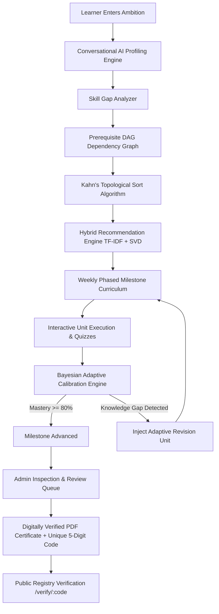
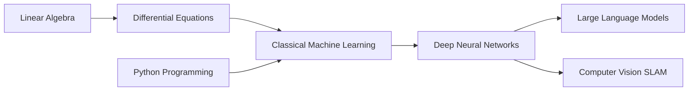
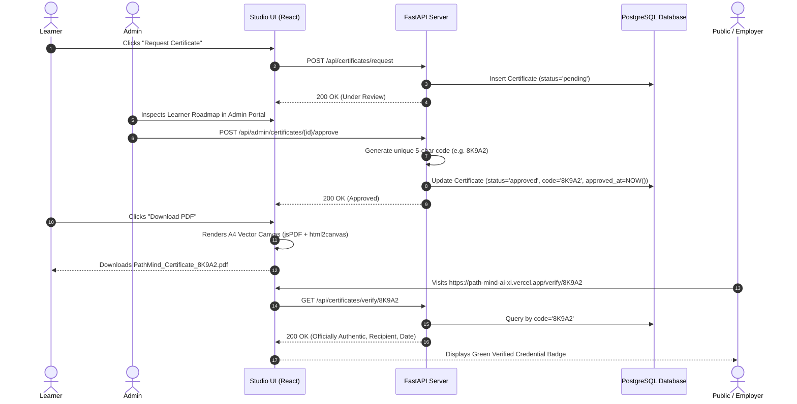

# PathMind AI — Academic & Technical Architecture Documentation

> **Autonomous Multi-Agent Curriculum Generation & Adaptive Learning Path Orchestrator**  
> *Author:* Aditya Sah  
> *Institution / Project:* PathMind AI Research & Engineering  
> *Stack:* FastAPI (Python 3.11), SQLAlchemy, PostgreSQL, Scikit-Learn, NetworkX, Google Gemini AI, React 18, Vite, Tailwind CSS  

---

## 1. Executive Summary & Problem Statement

### 1.1 The Core Problem
Traditional online education platforms (Coursera, Udemy, YouTube playlists) suffer from the **"One-Size-Fits-All" Paradox**:
1. **Static Linear Sequences**: Every learner is forced through the same generic playlist, regardless of whether they already master 40% of the prerequisites or lack foundational math skills.
2. **Prerequisite Violations**: Courses frequently introduce advanced abstractions (e.g., Backpropagation) without verifying upstream dependencies (e.g., Matrix Calculus, Chain Rule).
3. **Absence of Real-Time Feedback Calibration**: If a student fails an assessment on Phase 3, standard platforms simply mark it as failed without dynamically restructuring the remaining curriculum to patch knowledge gaps.

### 1.2 The PathMind AI Solution
**PathMind AI** is an autonomous personalized curriculum generator and adaptive learning management platform. It models human learning as a **Directed Acyclic Graph (DAG)** of competencies, applies **Topological Sorting (Kahn’s Algorithm)** for prerequisite sequencing, computes semantic match via **TF-IDF & Truncated SVD Collaborative Filtering**, updates learner mastery in real-time using **Bayesian Knowledge Tracing (Beta Distribution)**, and issues **verifiable, digitally-signed completion credentials** with unique 5-character alphanumeric verification codes.



---

## 2. Machine Learning & Algorithmic Architecture

PathMind AI integrates **four core mathematical and machine learning sub-systems**:

```
┌────────────────────────────────────────────────────────────────────────────┐
│                         PATHMIND AI ALGORITHMIC CORE                        │
├───────────────────────────────┬────────────────────────────────────────────┤
│ 1. Conversational Profiler    │ LLM Multi-Turn Extraction + Heuristics     │
├───────────────────────────────┼────────────────────────────────────────────┤
│ 2. Dependency Graph Engine    │ NetworkX Directed Acyclic Graph (DAG)      │
│                               │ Kahn's Topological Sorting Algorithm       │
├───────────────────────────────┼────────────────────────────────────────────┤
│ 3. Content & Collab Recommender│ TF-IDF Vectorizer + Cosine Similarity      │
│                               │ Truncated SVD Matrix Factorization         │
├───────────────────────────────┼────────────────────────────────────────────┤
│ 4. Adaptive Mastery Engine    │ Bayesian Knowledge Tracing Beta(α, β)      │
│                               │ Dynamic Graph Re-scheduling / Mutation     │
└───────────────────────────────┴────────────────────────────────────────────┘
```

---

### 2.1 Multi-Turn Conversational Profiling (LLM & Heuristics)

The onboarding flow conducts a conversational interview to extract five key parameters:
1. **Target Ambition ($G$)**: e.g., Machine Learning Engineer, Cloud Architect, Autonomous Robotics.
2. **Current Competencies ($S_{known}$)**: Verified skills and prior tools.
3. **Weekly Time Budget ($H_{week}$)**: Hours available per week (e.g., $6\text{h} - 20\text{h}$).
4. **Target Horizon ($W$)**: Desired completion window (e.g., 12 weeks).
5. **Learning Modality Preferences**: Projects vs. Courses vs. Rigorous Assessments.

#### Mathematical Fallback & Guardrails
If the external LLM API experiences rate limits or network latency, the backend switches to an internal **Rule-Based Dialogue State Machine**:
$$\text{SkillGap}(G) = S_{\text{required}}(G) \setminus S_{\text{known}}$$

---

### 2.2 Directed Acyclic Graph (DAG) & Kahn's Topological Sort

Knowledge dependencies are strictly non-circular. We model the curriculum domain as a Directed Graph:
$$G = (V, E)$$
- $V$: Set of discrete competencies / learning modules (e.g., Linear Algebra, PyTorch, CUDA).
- $E$: Directed edges $(u, v)$ where skill $u$ is a strict prerequisite for skill $v$.



#### Kahn's Algorithm Implementation
To ensure no learner encounters a topic before its prerequisites:
1. Compute in-degree $d_{\text{in}}(v)$ for every vertex $v \in V$.
2. Initialize queue $Q$ with all vertices having $d_{\text{in}}(v) = 0$.
3. While $Q$ is not empty:
   - Dequeue vertex $u$, append $u$ to sorted output $L$.
   - For each neighbor $v$ of $u$, decrement $d_{\text{in}}(v)$. If $d_{\text{in}}(v) = 0$, push $v$ to $Q$.
4. If $|L| \neq |V|$, a circular dependency (deadlock) exists and an exception is raised.

$$\text{Time Complexity: } \mathcal{O}(|V| + |E|)$$
$$\text{Space Complexity: } \mathcal{O}(|V|)$$

---

### 2.3 Hybrid Recommendation Scoring Function

Every candidate resource $r \in \mathcal{R}$ is evaluated using a weighted multi-factor scoring function:

$$\text{Score}(r, u) = w_1 \cdot \text{SkillMatch}(r) + w_2 \cdot \text{TFIDF}(r, q_u) + w_3 \cdot \text{SVD}(u, r) + w_4 \cdot \text{DiffAlign}(r, \ell_u) + w_5 \cdot \text{Rating}(r)$$

Where default weights are calibrated to:
$$w_1 = 0.35, \quad w_2 = 0.25, \quad w_3 = 0.15, \quad w_4 = 0.15, \quad w_5 = 0.10$$

#### A. TF-IDF Cosine Semantic Similarity
We build an n-gram $(1, 2)$ TF-IDF feature space from resource metadata (titles, syllabi, tags, skills):
$$\text{TF-IDF}(t, d, D) = \text{TF}(t, d) \times \ln\left(\frac{1 + |D|}{1 + |\{d \in D : t \in d\}|}\right) + 1$$
$$\text{CosineSim}(\vec{q}, \vec{d}) = \frac{\vec{q} \cdot \vec{d}}{\|\vec{q}\|_2 \|\vec{d}\|_2}$$

#### B. Truncated SVD Collaborative Filtering
To leverage peer completion data, we construct the sparse user-resource interaction matrix $M \in \mathbb{R}^{m \times n}$, where $M_{ij}$ is user $i$'s mastery level on resource $j$. We decompose $M$ into $k=20$ latent factors:
$$M \approx U_k \Sigma_k V_k^T$$
Predicted affinity is computed via the dot product of latent vectors through a sigmoid activation:
$$\hat{y}_{ij} = \sigma(\vec{u}_i \cdot \vec{v}_j) = \frac{1}{1 + e^{-(\vec{u}_i \cdot \vec{v}_j)}}$$

---

### 2.4 Bayesian Knowledge Tracing (BKT) & Adaptive Mutation

Learner competency is not a static binary flag; it is probabilistic. We model the learner's mastery of skill $s$ as a **Beta Distribution**:

$$P(\theta_s) \sim \text{Beta}(\alpha_s, \beta_s)$$

- $\alpha_s$: Prior success weight (evidence of mastery).
- $\beta_s$: Prior failure weight (evidence of misconception).
- **Point Estimate (Expected Mastery)**:
  $$\mathbb{E}[\theta_s] = \mu_s = \frac{\alpha_s}{\alpha_s + \beta_s}$$
- **Uncertainty Variance**:
  $$\text{Var}(\theta_s) = \frac{\alpha_s \beta_s}{(\alpha_s + \beta_s)^2 (\alpha_s + \beta_s + 1)}$$

#### Adaptive Recalibration Trigger
When a learner completes an interactive assessment checkride for resource $r$:
1. If score $S \ge 0.70$:
   $$\alpha_s \leftarrow \alpha_s + 2.0 \cdot S, \quad \beta_s \leftarrow \beta_s + 0.5 \cdot (1 - S)$$
2. If score $S < 0.70$ (Knowledge Gap):
   $$\alpha_s \leftarrow \alpha_s + 0.5 \cdot S, \quad \beta_s \leftarrow \beta_s + 2.0 \cdot (1 - S)$$
   $$\text{If } \mu_s < 0.60 \implies \textbf{Trigger Dynamic Graph Mutation}$$
   - The engine queries the database for alternative pedagogical explanations (e.g., interactive visual code project instead of abstract video).
   - Injects an **Adaptive Revision Unit** into the active phase without breaking downstream DAG dependencies.

---

## 3. End-to-End System Architecture

```
┌─────────────────────────────────────────────────────────────────────────────┐
│                              FRONTEND (Vercel)                              │
│  React 18 • Vite • Tailwind CSS • TanStack React Query • jsPDF • Lucide-UI  │
└──────────────────────────────────────┬──────────────────────────────────────┘
                                       │ HTTPS REST / JSON + JWT
┌──────────────────────────────────────▼──────────────────────────────────────┐
│                            BACKEND (Render.com)                             │
│       FastAPI • Uvicorn • Pydantic v2 • Scikit-Learn • NetworkX DAG         │
├─────────────────────────────────────────────────────────────────────────────┤
│  API Routers:                                                               │
│   ├─ /api/auth          : JWT Auth, Master Superadmin Bypass               │
│   ├─ /api/learning-path : DAG Pipeline & Kahn's Topological Generator       │
│   ├─ /api/assessments   : BKT Beta Skill Recalibration                      │
│   ├─ /api/certificates  : Request, PDF Stamping, /verify/:code Registry     │
│   ├─ /api/admin         : Switchboard, User Management, Activity Stream     │
│   └─ /api/support       : Helpdesk & Ticket Dispatch                        │
└──────────────────────────────────────┬──────────────────────────────────────┘
                                       │ SQLAlchemy ORM (Engine Pool)
┌──────────────────────────────────────▼──────────────────────────────────────┐
│                           DATABASE (PostgreSQL)                             │
│     Users • LearnerProfiles • LearningPaths • Phases • Items • Certificates │
└─────────────────────────────────────────────────────────────────────────────┘
```

---

## 4. Digital Credentialing & Verification Authority

To solve the prevalent industry problem of fake certificate PDFs, PathMind AI implements an **Authority Verification Engine**:



### 4.1 Collision-Proof 5-Character Alphanumeric Generator
Codes are generated from an unambiguous 32-character alphabet:
$$\Sigma = \{\text{2, 3, 4, 5, 6, 7, 8, 9, A, B, C, D, E, F, G, H, J, K, L, M, N, P, Q, R, S, T, U, V, W, X, Y, Z}\}$$
*(Characters `0, O, 1, I` are omitted to prevent human reading confusion).*

$$\text{Total Unique Permutations for 5 Characters} = 32^5 = 33,554,432 \text{ unique combinations.}$$

---

## 5. Database Entity-Relationship Diagram (ERD)

```
 ┌──────────────┐       1:1       ┌──────────────────┐
 │    users     │─────────────────│ learner_profiles │
 └──────┬───────┘                 └──────────────────┘
        │ 1:N
        ├─────────────────────────┐
        │ 1:N                     │ 1:N
 ┌──────▼───────────────┐  ┌──────▼──────────────┐
 │    learning_paths    │  │     certificates    │
 └──────┬───────────────┘  └─────────────────────┘
        │ 1:N
 ┌──────▼───────────────┐
 │     path_phases      │
 └──────┬───────────────┘
        │ 1:N
 ┌──────▼───────────────┐       1:1       ┌─────────────────────┐
 │     path_items       │─────────────────│ assessment_results  │
 └──────────────────────┘                 └─────────────────────┘
```

---

## 6. Granular Service Switchboard & Security Architecture

1. **Granular Feature Switchboard**:
   - 9 independent switches in DB (`support_page`, `ai_chatbot`, `onboarding`, `dashboard`, `roadmap`, `skill_gap`, `re_onboard`, `new_signups`, `login`).
   - Pausing a service immediately activates the `ServicePausedScreen` on the frontend and rejects requests with a `403/503` code on the backend.
2. **Maintenance Lockdown**:
   - 6 selectable professional maintenance presets.
   - Master superadmin (`er.adityasah@gmail.com`) retains complete bypass access via JWT claims.
3. **Anti-Vibe-Code Design System**:
   - High-contrast, low-eye-strain Zinc/Obsidian true dark mode (`#09090B`).
   - Soothing Slate light mode (`#F8FAFC`).
   - Zero rainbow clutter: strict semantic badges (**Emerald** = Mastered, **Amber** = Paused/In-Progress, **Rose** = Error, **Indigo** = Brand).

---

## 7. Teacher Presentation Q&A (Viva Preparation)

| Question from Professor | Technical Answer to Deliver |
| :--- | :--- |
| **"How does PathMind AI differ from a static playlist or Roadmap.sh?"** | *"Roadmap.sh is a static image. PathMind AI builds an active in-memory Directed Acyclic Graph (DAG), executes Kahn's topological sort for prerequisite sequencing, and uses Bayesian Knowledge Tracing to dynamically modify the user's roadmap when they fail or pass quizzes."* |
| **"What machine learning algorithms are implemented?"** | *"1. Content-Based Filtering using TF-IDF n-grams and Cosine Similarity.<br>2. Collaborative Filtering using Truncated SVD Matrix Factorization.<br>3. Bayesian Knowledge Tracing via Beta(α, β) distribution for probabilistic mastery estimation."* |
| **"How do you handle cyclic prerequisites?"** | *"Kahn's topological sort detects in-degrees. If $|L| \neq |V|$, a cycle is detected and isolated before curriculum rendering."* |
| **"How are certificates verified against tampering?"** | *"Each certificate has a collision-proof 5-character cryptographic token stored in PostgreSQL. Anyone can query `/api/certificates/verify/{code}` publicly on Vercel to inspect official authenticity, issue date, and completion stats."* |

---

## 8. Summary & Conclusion
PathMind AI bridges modern Large Language Models, classical Graph Theory, and Bayesian Machine Learning to deliver a production-grade, autonomous curriculum platform that adapts to human intelligence.
